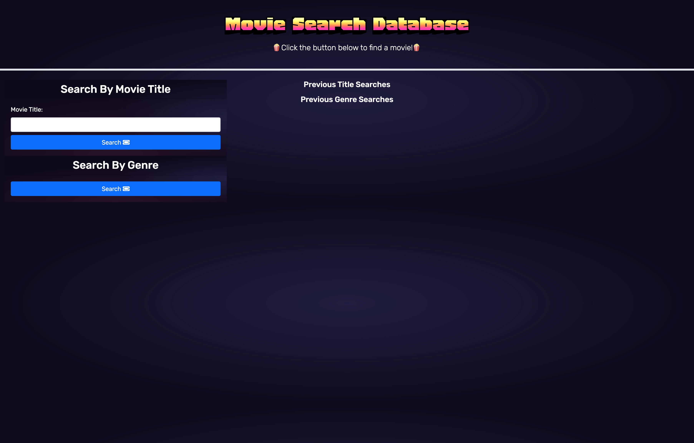
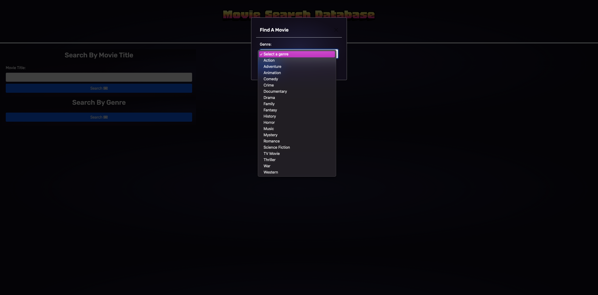
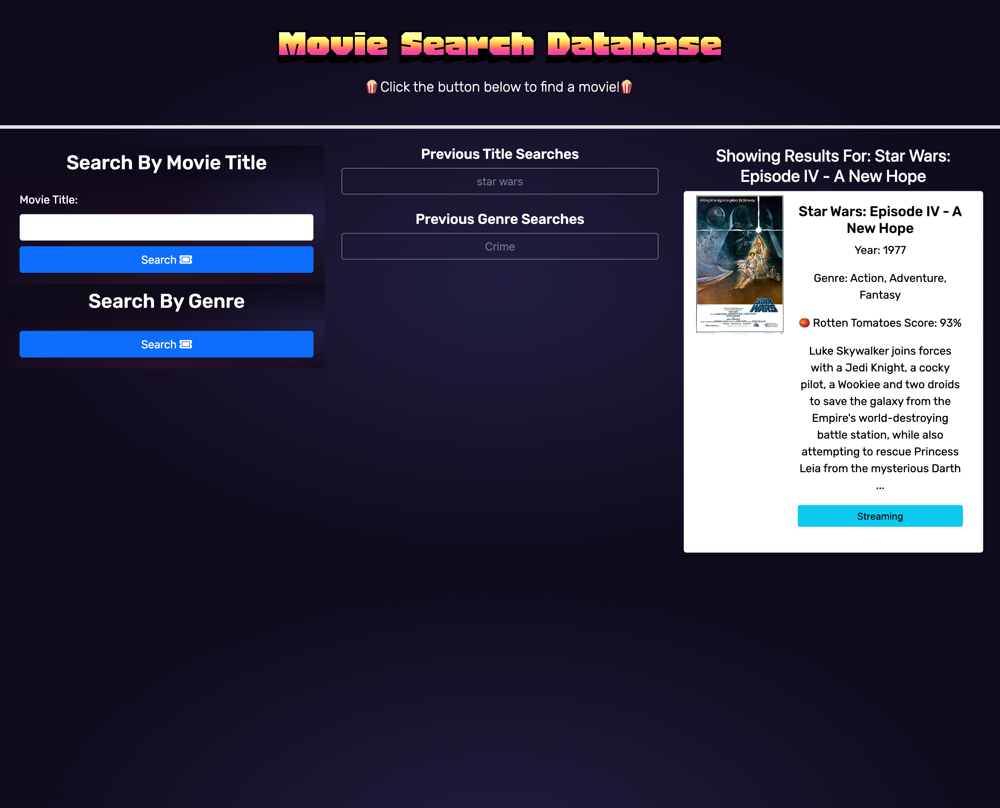
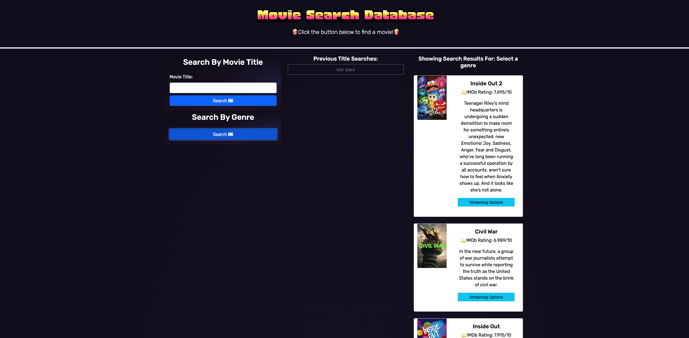
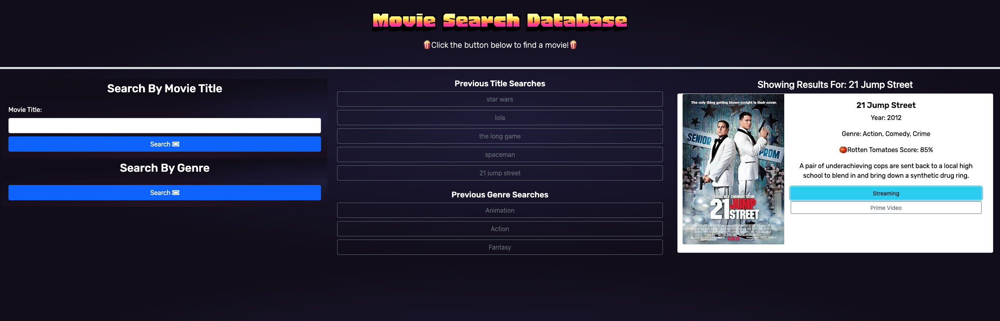

# Group Project One: Movie Night

## Description

- Movie search directory to find movies by name or genre along with a description and where to stream.
- When a user opens the page, they will have the option to search by movie title or genre.
- When user searches by movie title, they will be presented with the movie poster, description, rotten tomatoes score, year the movie was released, and a button to see where to stream the movie.
- When a user clicks the search by genre button, they will be presented with a modal to pick which genre they would like to search by.
- Once a genre is selected, a list of movies with the movie poster, description, rotten tomatoes score, year the movie was released, and a button to see where to stream the movie.
- All past searches are saved to localStorage for user to go back to and are saved if page is closed.

### Tasks completed

- Use of bootstrap for styling page.
- Includes two server-side APIs.
- Uses a modal when searching by genre.
- Past searches are saved to localStorage to revist and will be saved if page is closed.
- Interactive page that will accept and respond to user input.

# Live webpage

[Click here to view page!](https://natale565.github.io/movie-night/)

## Built with

- HTML
- CSS
- JavaScript
- Bootstrap
- Server-side APIs

# API's used

- [OMDb API](https://www.omdbapi.com/)
- [Rapid API Advanced Movie Search](https://rapidapi.com/search?term%3Dadvanced%2520movie%2520search%26sortBy%3DByRelevance)
- [Rapid API Streaming Availability](https://rapidapi.com/movie-of-the-night-movie-of-the-night-default/api/streaming-availability/playground/apiendpoint_14b2f4b9-8801-499a-bcb7-698e550f9253)

# Screenshots of web page

